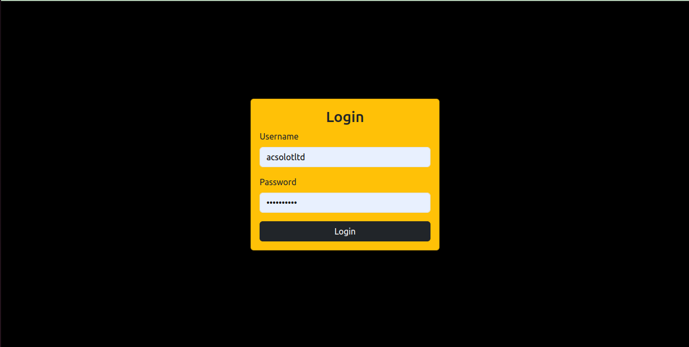
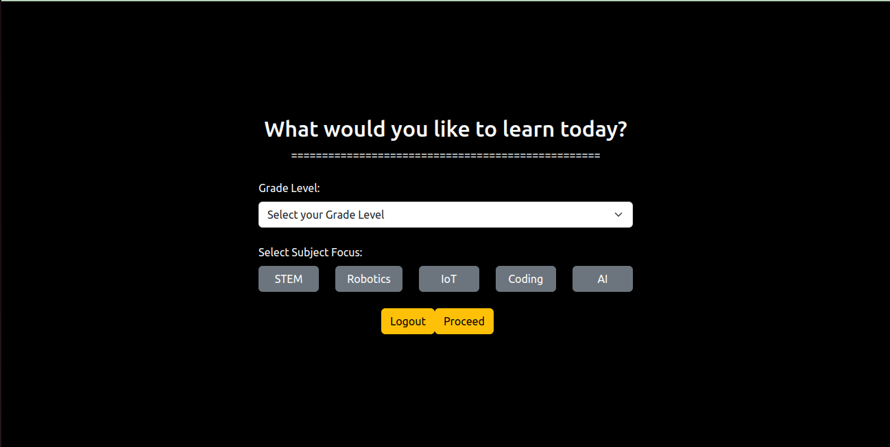
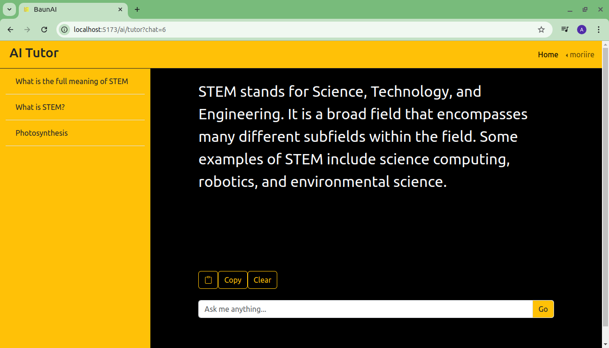

# Baun AI Tutor

Baun AI Tutor is a component of Baun Eduvault, an educational device designed for personalized learning using Large Language Models (LLM). This project is a Vue.js-based application that allows users to log in, select subjects or courses, engage with an AI tutor, take quizzes, and monitor their progress. It is built to provide an interactive learning experience tailored to each user's needs.

## Table of Contents
- [Features](#features)
- [Screenshots](#screenshots)
- [Installation](#installation)
- [Running the Application](#running-the-application)
- [Pages](#pages)
- [License](#license)

## Features
- **Personalized learning** using AI-powered tutor.
- **Interactive quizzes** to assess user knowledge.
- **Progress tracking** to monitor user performance.
- **Subject/course selection** for a customized experience.

## Screenshots

### 1. Login Page


### 2. User Subject/Course Selection Page


### 3. AI Tutor Page


### 4. Quiz Page


### 5. Dashboard/Progress Page


## Installation

### Prerequisites
- Node.js >= 18
- Vue CLI
- Yarn package manager

### Steps to Install

1. Clone the repository:

   ```bash
   git clone https://github.com/your-username/Baun-AI.git
   ```

2. Navigate to the project directory:

   ```bash
   cd Baun-AI
   ```

3. Install dependencies:

   ```bash
   yarn install
   ```

## Running the Application

1. To run the app in development mode, use the following command:

   ```bash
   yarn dev
   ```

   The app will be running on `http://localhost:5173`.

## Pages

### 1. Login Page
Users log in with their credentials to access their personalized learning dashboard.

### 2. User Subject/Course Selection Page
After logging in, users can select subjects or courses they wish to learn or engage with.

### 3. AI Tutor Page
An AI-powered tutor provides personalized learning, answering questions and explaining topics based on the user’s selected course.

### 4. Quiz Page
Users can take interactive quizzes to test their knowledge in their selected subjects.

### 5. Dashboard/Progress Page
Displays the user’s progress, including quiz scores and course completion status.

## License
This project is licensed under the MIT License - see the [LICENSE](LICENSE) file for details.